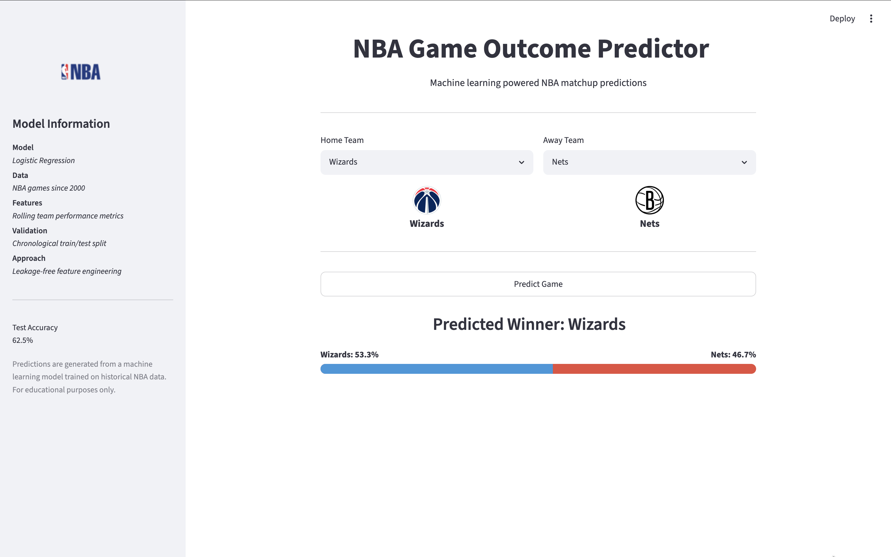

# 🏀 NBA Game Outcome Predictor

An end-to-end machine learning application that predicts NBA game outcomes using chronological, leakage-free feature engineering and an interactive Streamlit dashboard.

The project combines a complete machine learning pipeline with a user-facing web application where users can select NBA matchups and receive predicted win probabilities based on historical team performance.

---

## Application Demo



---

## Project Goal

The goal of this project was to build a realistic NBA prediction system that only uses information available before each game occurs.

To simulate real-world prediction conditions, the pipeline focuses on:

* Chronological data processing
* Leakage-free feature engineering
* Time-based train/test validation
* Historical team performance trends

---

## Dataset

**Source:** [Kaggle Historical NBA Data and Player Box Scores Dataset](https://www.kaggle.com/datasets/eoinamoore/historical-nba-data-and-player-box-scores)

Dataset details:

* Historical NBA games from 1946–2026
* Model training focuses on the modern NBA era (2000–present)
* 36,000+ games used after filtering and preprocessing
* Includes regular season and playoff games

---

## Machine Learning Pipeline

The prediction pipeline consists of the following stages:

1. Load and clean historical NBA data
2. Filter games to the modern NBA era
3. Build chronological team-level performance timelines
4. Engineer leakage-free rolling statistics
5. Create matchup-based machine learning features
6. Perform an 80/20 chronological train/test split
7. Train a Logistic Regression classifier
8. Evaluate model performance
9. Generate predictions for new NBA matchups

---

## Feature Engineering

All features are designed to prevent data leakage. Rolling statistics use `.shift(1)` so that each prediction only uses information from games that occurred before the predicted matchup.

Engineered features include:

* 5-game rolling win percentage
* 10-game rolling win percentage
* 5-game average point differential
* 10-game average point differential

Separate home and away team features are generated to create matchup-level predictions.

---

## Model Performance

**Model:** Logistic Regression, chosen as a strong, interpretable baseline before testing more complex models
**Validation Method:** Chronological 80/20 train/test split
**Test Accuracy:** ~62.5%

The model performs above the historical home win baseline while maintaining a realistic evaluation strategy that avoids random data leakage.

---

## Streamlit Application Features

The interactive dashboard allows users to:

* Select any NBA matchup
* View team logos and matchup information
* Generate predicted win probabilities
* See the predicted winner
* Compare recent team performance
* View last 10 game form indicators

---

## Repository Structure

```text
NBA-Game-Predictor/
│
├── app.py                         # Streamlit application
│
├── artifacts/
│   ├── model.pkl                  # Trained Logistic Regression model
│   ├── team_timeline.pkl          # Chronological team performance data
│   └── feature_cols.pkl           # Model feature definitions
│
├── src/
│   └── predict.py                 # Model loading and prediction functions
│
├── assets/
│   ├── nba_logo_transparent.png
│   └── nba_predictor_demo.png     # Application screenshot
│
├── data/
│   └── nba_games.csv              # Local dataset (not included)
│
├── notebooks/
│   ├── 01_exploration_and_draft.ipynb
│   └── 02_nba_game_prediction_pipeline.ipynb
│
├── requirements.txt
├── README.md
└── .gitignore
```
*The raw dataset is not included due to size and licensing considerations. Download it from the Kaggle link above and place it in the `data/` directory.*

---

## Running the Application

### 1. Clone the repository

```bash
git clone https://github.com/heaven-f/nba-game-predictor.git
cd nba-game-predictor
```

### 2. Install dependencies

```bash
pip install -r requirements.txt
```

### 3. Launch the Streamlit dashboard

```bash
streamlit run app.py
```

The application will open in your browser where you can select teams and generate predictions.

---

## Technologies Used

* Python
* Pandas
* NumPy
* scikit-learn
* Streamlit
* Jupyter Notebook
* Git

---

## Future Improvements

Potential improvements for future versions include:

* Elo rating integration
* Player-level performance features
* Injury and availability data
* Rest days and travel effects
* Strength of schedule adjustments
* Additional model comparisons (Random Forest, XGBoost)
* Model deployment with live NBA data

---

## Author

**Heaven Frazier**
B.S. Computer Science
University of the District of Columbia